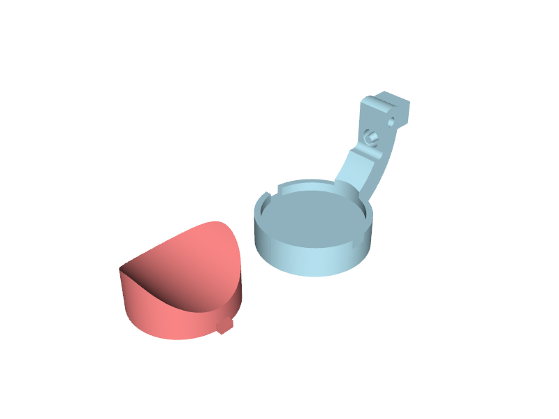
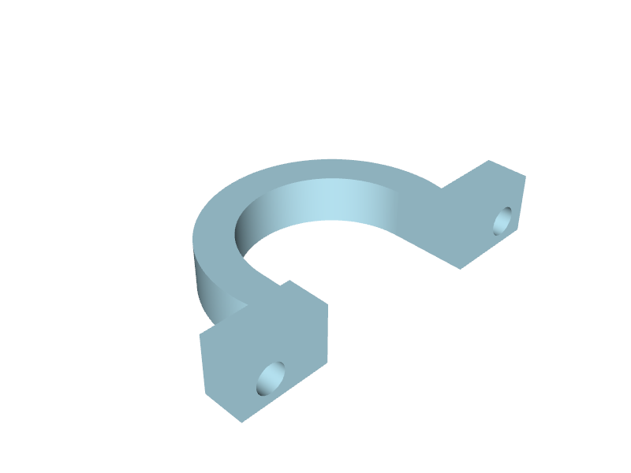
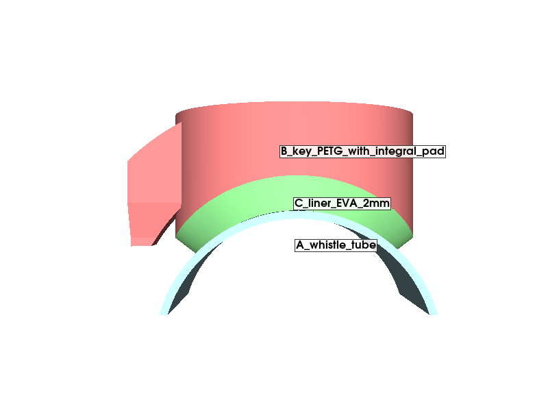
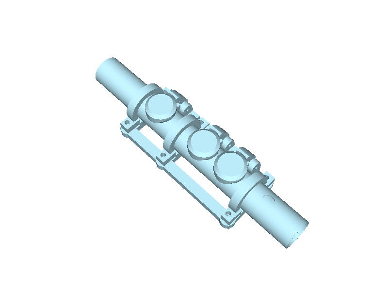

# Measured three-key prototype

The working hole-4 mechanism is extended to holes 4, 5 and 6 on one 71.595 mm
frame. Each curved key has its own normally open coil spring, 1 × 12 mm steel
pin and an integral concave pad face carrying a glued 2 mm EVA liner. All
three keys are now identical,
sized for the largest measured hole (7.80 mm). All geometry is metric and controlled
by `scripts/three_key.py`.

## Measurements and pad sizes

Bottom edges are independently measured from the whistle foot; centres are
derived separately from the axial diameters, as requested by the player.

| Hole | Bottom edge | Axial diameter | Centre | Pad OD | Cup OD |
|---|---:|---:|---:|---:|---:|
| 4 | 79.15 | 5.09 | 81.695 | 12.30 | 14.20 |
| 5 | 62.05 | 7.80 | 65.950 | 12.30 | 14.20 |
| 6 | 35.30 | 7.60 | 39.100 | 12.30 | 14.20 |

Centre spacings are 15.745 mm and 26.850 mm. Hole 3 is included as a reference
at centre 102.90 mm, diameter 5.80 mm. The unkeyed hole 3 bottom edge is 100 mm.

Transverse sizes of holes 5 and 6 are unconfirmed. The model uses circular
clearance envelopes with the measured axial diameters, conservatively covering
holes whose transverse dimensions do not exceed those values. These envelopes
are not a claim that the real holes are circular or an acoustic whistle model.
The player confirmed the recorded hole measurements on 2026-09-09. The common
pads require a sealing trial; only the earlier, smaller hole-4 TPU pad has been tried.

## Frame and clamps

End clamps sit at 28.100 and 92.695 mm from the foot, with a third clamp
between keys 5 and 6 at 52.475 mm. The raised bands are
4 mm wide and the bolt supports 6 mm wide. The upper band stops at 94.695 mm,
leaving 5.305 mm to hole 3's bottom edge. Actual finger comfort remains a trial.
A continuous low spine joins the three reinforced hinge pedestals. The pin
approach and key-tail clearance are retained. Each opening stop engages at 20°.

The new frame uses the revised 14.3 mm seats for bare 14.2 mm brass and a
1.2 mm split gap. It requires the matching caps supplied here. A CAD closure
check establishes seat contact before the clamp faces bottom out; it does not
establish actual gripping force. Fit without a liner and verify the printed
clamp holds. The previously requested cap-only fix for the old single-key frame
is not needed to assemble this longer three-key frame; the old single-key files
remain separate. Underside hex pockets now stop the M2 nuts turning.

## Hardware and assembly

- Three steel pins, 1 mm diameter × 12 mm long.
- Three compression springs, nominal 2 mm OD × 5 mm free length, assumed 2 mm
  solid length and 0.3 mm wire. Spring rates are still unknown.
- Six M2 bolts and six M2 nuts seated in underside hex pockets; check the existing bolt lengths fit.
- PETG frame, three caps and three keys; 2 mm EVA foam sheet and pad adhesive.
  No TPU part remains: the pad face is printed as part of each key.

Each fixed bearing bore is 1.1 mm for the requested fit trial; each moving bore
is 1.25 mm. Each peg is 1.5 mm long, tapering from 1.2 to 1.0 mm diameter. The
nominal spring seat spacing remains 2.8 mm closed and about 3.70 mm open.

Install pins in order **4, then 5, then 6**. Feed from the foot end through
lower empty bearing bores. A straight 1 mm wire used as an assembly pusher can
advance the upper pin through the lower bearings; remove it after seating each
12 mm pin. Do not fit the lower pins first, because they block that route.
The CAD checks this entire insertion sequence including previously seated pins,
keys, frame, caps, tube and nominal M2 head envelopes. Physical manipulation
and spring fitting still need a trial on this longer assembly.

## Print files

Open the 3MF as a project in Bambu Studio, select the actual material and bed
profiles, then slice and inspect supports. These files contain no G-code.

- `exports/three-key/whistle-three-key-P1S.3mf`: one PETG plate with all nine
  pieces - frame, three keys, three clamp caps, cutting guide and pin coupon.
  Every part is PETG, so there is no second plate and no material change.
- `exports/three-key/assembly-open.step`: complete assembly for review.
- `exports/three-key/assembly-closed.step`: the same assembly closed, for
  checking the pads against the whistle body.
- `exports/three-key/print-oriented/`: one file per distinct part. Print
  `lever_print` three times and `clamp_cap_print` three times. The earlier
  `lever4/5/6_print` files were byte-identical copies and are removed; any key
  fits any of the three positions.

The frame rests flat on its base. Keys rest on their finger faces and caps on
end faces. Supports are enabled for the frame and keys. PETG uses 0.16 mm
layers and four walls. Print three identical keys; no markings or sorting are
needed. The pad face prints as part of the key, so its surface finish matters:
keep the dished underside free of stringing before gluing the EVA.
The frame, caps, pins and springs are reusable, but the keys are new.

## Verification

`tests/test_three_key.py` checks measured positions, valid solids and export
round trips, 21 positions for each key, actual stop contact and overtravel,
1 mm open-airway clearance, seal coverage, at least 1 mm key/pad clearance to
caps, and the mounting and pin-insertion checks described above. Key-to-key
clearance is checked from axial extents, which remain invariant under their
hinge rotation, covering independent key combinations. Frame collision checks
use exact frame sections spanning the full invariant axial extent of each key.

The shared 3MF tests verify quantities, mesh integrity, materials, plate layout,
and preserved orientation for both single-key and three-key projects. CI builds
and tests both prototypes. These checks do not replace physical trials of grip,
finger access, print strength, spring feel or sound.

Regenerate and package from the repository root:

```sh
python scripts/build_ci.py --model three_key --output build/three-key
python scripts/package_3mf.py --three-key --source build/three-key --output build/three-key/whistle-three-key-P1S.3mf
```

The assembly STEP contains solid cylindrical spring envelopes for illustration.
They deliberately overlap the locating pegs and sockets; they are not printable
parts or a model of the coil wire. The separate printable parts pass solid and
mesh validation.

## Opposite-side frame rail

A 5 mm wide rail joins the two clamp bases on the side opposite the keys,
closing the frame to resist twisting. Both lower rails are flush with the
clamp-base bottoms, giving a continuous flat printing base. The rail stays
below the tube and outside its surface, preserving the cap split and pin route.
Only the frame needs reprinting relative to the first three-key version.
Physical stiffness and thumb comfort remain trial checks.

## Middle clamp between keys 5 and 6

A third clamp at 52.475 mm is centred in the measured 19.15 mm edge gap
between holes 5 and 6. Its cap is identical to the end caps. Six M2 bolt
passages are drilled through the completed frame, including the raised spine.
The movement, mounting and insertion checks include all three clamps.
Compared with the first three-key prototype, reprint the frame and one extra
cap, and add two M2 bolts and nuts. Existing keys, pads and two caps are reusable.
Both 3MF projects now contain eleven pieces and orient the frame flat on its base.

The raised hinge-side spine steps down locally at the middle clamp, with 0.2 mm axial clearance at each side, so the cap can seat and tighten. Both lower rails remain continuous.

## Underside M2 nut pockets

All six bolt positions have hexagonal pockets opening from the bottom of the
frame. Each pocket is 4.30 mm across flats and 1.90 mm deep. The default nut
is 4.00 mm across flats and 1.60 mm thick, matching this
[Accu M2 DIN 934 specification](https://www.accu.co.uk/hexagon-nuts/766417-NUT202M2).
Actual nut dimensions have not yet been confirmed by the player. Dimensions
and print clearance are parameters near the top of `scripts/three_key.py`.

Local 7 mm diameter bosses leave at least 1 mm material outside pocket corners
and a 1.6 mm bearing roof above each nut. Bolt centres and clamp interfaces are
unchanged. The frame stays flat on the bed; inspect and remove any support
inside the pockets before inserting nuts. Only the frame needs reprinting.

Insert nuts from underneath, flat against the pocket roofs, then engage the
bolts from above. The hex walls prevent rotation once engaged. These are open
pockets, not snap-fit retainers: a small piece of tape can hold a nut while
starting its bolt. Bolts can protrude farther below the frame with recessed nuts.

Tests check the full nut insertion sweep, fit at the seated position, contact
with the bearing roof, blocked rotation and material around each pocket.
Printed nut fit and resistance to tightening torque still need a physical trial.
The nut-pocket revision retained individual pad sizes. On 2026-09-09 the player
confirmed the measurements and requested identical parts for all three positions.
The shared pad is 12.30 mm OD; cup ID is 12.60 mm and head OD is 14.20 mm.
Minimum axial head-to-head clearance is 1.545 mm throughout rotation. The
common geometry is tested for interchangeability, travel and sealing coverage.
The larger hole-4 head still needs a playing trial for finger comfort.


## Pad locating tabs — 2026-09-09



All three common keys now have two opposed notches in the retaining ring,
aligned along the whistle axis. Each TPU pad has matching tabs, 1.6 mm wide,
0.9 mm thick and extending 0.75 mm beyond its 12.30 mm circular body. Overall
pad length across tabs is 13.80 mm, within the 14.20 mm key-head envelope.
Notches are 2.0 mm wide, giving 0.20 mm nominal clearance on each side.

The notches open from the pad side through the ring's 1.2 mm height. The tabs
are flush with the flat glue backing; the solid cup roof remains the seating
stop. Align the tabs with the notches and press the backing fully against the
roof before gluing. A 180-degree reversal is equivalent; a 90-degree rotation
is blocked. These are locating features, not snap-fit retainers.

The tabs sit above the tube crown and do not interrupt the curved sealing
face. Printing orientation stays the same: keys finger-face down, pads flat
back down. Print the new keys and pads together; reuse the frame and hardware.
Tests cover tab insertion, correct/incorrect orientation, full seating,
interchangeability, key travel and the continuous sealing band. Confirm the
nominal tab clearance in the PETG/95A TPU printing trial.

## Clamp cap flat-end correction — 2026-09-09

The previous 4 mm curved band was centred between 6 mm bolt tabs. With a tab
end on the bed, the curved band started 1 mm in mid-air. That orientation was
incorrect for support-free printing; disabling supports did not make it printable.

The bed-facing tab ends now finish flush with the curved band. Tab axial width
is 5 mm, from -2 to +3 mm relative to the bolt centres; the opposite ends retain
their previous positions. Ring width, ring position, bolt centres and clamp gap
are unchanged. The shortest axial ligament beside a 2.4 mm bolt bore is 0.8 mm;
check the PETG tabs during tightening. Print the supplied orientation, with the
complete flat C-shaped end on the bed. The small horizontal bolt bores still
require short bridges, but the curved band no longer starts unsupported.

A first-layer section test verifies one connected full-profile footprint, rather
than two disconnected bolt-tab islands. Reprint only the three clamp caps. The
frame, keys, pads and hardware remain compatible.



## Integral pad face for 2 mm EVA — 2026-09-11



The separate TPU carrier, its retaining ring and the locating tabs are removed.
Each key now has a dished pad boss printed as part of the key, and the 2 mm EVA
liner is glued straight into it. The sections above describing the 12.30 mm
carrier, the 12.60 mm cup and the pad tabs are superseded.

The dish is a cylinder of 8.9 mm radius concentric with the whistle at closure
(7.1 mm tube radius, less 0.2 mm interference, plus the 2 mm sheet). The glue
surface is a single continuous face of 175.69 mm² with no ring, notch or step
in it, and 3.8 mm of solid PETG sits above it. The pad face stays 14.2 mm
across, so head-to-head clearance remains 1.545 mm.

Using the full 14.2 mm face instead of a 12.3 mm carrier more than offsets the
thicker sheet: the continuous seal band is 3.04 mm at hole 4, 1.68 mm at hole 5
and 1.78 mm at hole 6, against 2.29, 1.55 and 1.65 mm for the 1 mm liner. Key
volume rises from 749 to 957 mm³. Opening, stop, spring seats, hinge, frame and
clamps are unchanged: pad-centre lift is still 4.670 mm at 35°.

Printed parts drop from ten to five files and the build is now entirely PETG,
so no TPU spool is needed. The three keys were identical copies, so they are
exported once as `lever_print` and printed three times, as the clamp cap
already was. The cutting guide and its 3MF are resized: the traced
outline is 14.59 × 14.20 mm. Reprint the three keys and the cutting guide, cut
three new liners, and reuse the frame, caps, pins, springs and hardware.

## 3 mm spring variants — 2026-09-11

`scripts/three_key.py` now carries a spring table and builds three variants from
one source. `scripts/build_ci.py --model` selects them; run on its own the file
still builds the 2 mm mechanism.

| variant | coil | opening | seat Z | collar gap | preload | pad lift | open pad to tube |
|---|---|---|---|---|---|---|---|
| `three_key` | 2.0 × 5.0 | 35° | 3.10 | 0.577 | 0.376 | 4.670 | 4.042 |
| `three_key_3mm_spring` | 3.0 × 6.0 | 35° | 3.70 | 0.291 | 1.022 | 4.670 | 4.042 |
| `three_key_3mm_short_spring` | 3.0 × 5.0 | 30° | 3.52 | 0.214 | 0.407 | 4.300 | 3.450 |

The coil axis passes over the pivot, so clearance to the reinforced hinge collar
is the perpendicular distance from the pivot to that axis, less the collar's
1.525 mm radius and the coil radius. A 3 mm coil takes 0.5 mm more than a 2 mm
one, and the worst case is at full opening where the coil is most tilted. The
seat must rise to compensate, which lengthens the swing and spends preload.

With a 5 mm free length that trade runs out at 30°: 31° needs a 3.56 mm seat to
hold 0.2 mm clearance, and preload there falls to 0.330, below the 0.35 standard
the 2 mm build meets. A 6 mm free length removes the conflict entirely and keeps
the full 35° opening with 1.022 mm preload.

Changing the coil changes the frame seat (4.2 mm wide, 3.4 mm bore) and the key
peg (1.8 tapering to 1.5 mm), so each variant has its own frame and keys. The
pad face, EVA liner, cutting guide, hinge, clamps and hardware are identical
across all three. Solid heights are assumptions: measure the actual coils, since
the retained 2.8 mm closed spacing allows at most 2.3 mm solid.

## Closure over-travel for the leaking seals — 2026-09-11

The player trial reported that the pads do not seal reliably enough to play.
The cause is not pad size or spring force: nothing hard-stops the key at
closure, so finger force should compress the foam, but the key landed on the
top rear corner of the spring holder only 1.22° past nominal closure. That
capped foam compression at 0.44 mm, 22% of the 2 mm liner, however hard the key
was pressed — and 0.1 mm of PETG oversize in that corner takes it back to the
0.2 mm design figure, or 10%. Foam needs roughly 25-40% compression to conform
to a hole rim, so the seal was marginal by design and varied between keys.

The key's spring-housing relief goes from 0.3 to 0.8 mm. The key can now be
pressed 9.36° past nominal closure before touching anything, which is 1.82 mm
of pad travel; at a working 3° the pad moves 0.59 mm for 0.79 mm total
compression, about 39% of the liner, with 1.21 mm still left to the tube. The
foam is now genuinely the only stop. The arm width blend tracks the relief so
the transition fillet keeps its constant-width edge, and the reinforcement
checks are unchanged. Key volume falls from 956.5 to 944.8 mm³.

Reprint the three keys; the frame, caps, liners and hardware are unaffected.
A test pins the over-travel so this cannot silently regress.

If the seal is still poor after this, the remaining levers are, in order: seat
the liners by holding the keys closed overnight, as woodwind pads are seated;
then narrow the pad along the whistle, where the band is 3.20 mm against
1.76 mm across it. Trimming the along-tube dimension from 14.2 to 10 mm nearly
doubles contact pressure, because the hole itself carries no load. A leak that
appears on one side only is hinge slop, not compression, and needs the pin fit
addressed instead.

## Ergonomic key tops — 2026-09-12



The overnight seating trial fixed the seals, so the keys are now shaped for the
finger. The pad boss ran out to the arm's own crown, leaving a flat-topped drum
standing proud of the arm: 725 mm³ of PETG above the recess, 77% of the key,
7.33 mm thick at the pad rim against 3.80 mm at its centre.

The finger face drops to a flat plane 11.0 mm from the tube axis, 3.9 mm above
the whistle, with a 1.5 mm chamfered rim. The plane is close to tangent to the
arm's curve, so the arm rises into the face rather than stepping against it.
The cut runs across the whole key because the reinforced arm reaches radius
13.7, higher than the finger face; the bend the strength tests probe sits at
z 7.5-8.5 and is untouched.

| | before | after |
|---|---|---|
| key volume | 944.8 mm³ | 635.9 mm³ (-33%) |
| PETG above the recess, centre | 3.80 mm | 2.10 mm |
| finger face | flat disc, square rim | 25 mm crowned cylinder |
| print height | 14.7 mm | 13.0 mm |
| bed contact printing face down | 158 mm² | 87 mm² |

The pad face, EVA recess, liner, hinge, spring interfaces and opening are
unchanged, so the seal and travel behaviour carry over untouched, as does the
0.79 mm of closure compression. All three spring variants get the same top.
Reprint the three keys; reuse the frame, caps, liners, pins and springs.
### Crowned face, 2026-09-12

The flat face, its rim chamfer and the faceted reinforcement crown are replaced
by a single cut: a cylinder of 25 mm radius about the tube axis, truncated by a
0.2 mm flat landing at the apex so the part still starts on the bed. One smooth
surface now runs from the arm over the pad, and the angular shoulder above the
arm reinforcement is gone.

The crown must be cylindrical, not spherical. The EVA recess is a cylinder
about the same axis, so it does not vary along the whistle; a spherical crown
does, and closes on the recess at the pad's axial edges, leaving 1.30 mm of
PETG there against the 2.10 mm a cylindrical crown holds everywhere. The
radius is set by the arm bend the strength tests probe at z 7.5-8.5, which the
crown must stay above: 25 mm clears it, 20 mm cuts into it.

The pad's two axial edges are left square where the crown meets the 14.2 mm
side wall. Rounding them would eat into that 2.10 mm wall.

### Earlier flat face

The rim relief chamfers the finger face's own boundary, not the pad circle.
Relieving the circle cut a 1.4 mm trench between the arm and the pad, because
the arm reaches the face at full height: at y = 0 the surface ran 11.00 on the
arm, down to 9.60, then back to 11.00 on the pad. Chamfering the face edges
leaves that junction continuous and only softens the free rim.

A test pins the flat face, its area, the relieved rim, and that the surface
never dips on the way from the arm into the pad.

## Opening reduced to 27 degrees — 2026-09-12

The player measured about 6 mm of gap above an open hole and asked for 2 mm
less. The figure the earlier notes quoted, 4.042 mm, is the minimum three
dimensional distance from the liner to the tube, which occurs off to the side
at the pad's trailing edge. Straight up over the hole, where it is actually
measured, the 35 degree opening gives 5.94 mm. The model and the instrument
agree; only the quoted quantity was wrong.

Opening drops from 35 to 27 degrees on all three variants.

| | 35 deg | 27 deg |
|---|---|---|
| gap straight up over the hole | 5.94 mm | 4.78 mm |
| finger travel (pad lift) | 4.670 mm | 4.027 mm |
| minimum 3-D liner to tube | 4.042 mm | 3.090 mm |
| spring preload, 2 mm coil | 0.376 mm | 0.772 mm |
| spring preload, 3 x 6 mm coil | 1.022 mm | 1.495 mm |
| spring preload, 3 x 5 mm coil | 0.407 mm | 0.578 mm |

27 degrees gives 1.16 mm of the 2 mm asked for. A full 2 mm needs 22 degrees,
which drops the minimum three dimensional clearance to 2.48 mm and breaks the
3 mm rule; 27 degrees keeps it at 3.09 mm. Preload roughly doubles on the 2 mm
coil, so the return action should be more positive.

Only the frame changes: the opening stop is part of the frame, and the key
geometry does not depend on the angle. Reprint the frame alone and reuse the
keys, caps, liners, pins, springs and hardware. Whether the smaller opening
affects the tone of these notes is a playing question; CAD cannot answer it.

## Key fracture at the 60-65 degree station — 2026-09-12

A key fractured before it was even played, on the outside of the curve roughly
level with the spring housing. The cause was the closure over-travel fix: the
spring-housing relief was opened from 0.3 to 0.8 mm in both x and z, and the x
component cut the arm from the inside exactly where bending stress peaks.

Bending stress index M/Z along the arm, with the finger load on the pad and the
reaction at the pivot:

| station | before the relief change | after it | now |
|---|---|---|---|
| 60 deg | Z 10.04, stress 0.97 | Z 5.59, stress 1.74 | Z 5.63, stress 1.72 |
| 65 deg | Z 4.86, stress 2.09 | Z 2.77, stress 3.66 | Z 7.44, stress 1.37 |

The two probes that were supposed to guard the bend sit at 55 and 70 degrees,
either side of the damage, so nothing failed.

Two changes. The relief is split: 0.3 mm in x as before, 0.8 mm in z. The
over-travel comes almost entirely from the z component, so this keeps 3.58
degrees past nominal closure and the full 0.79 mm of foam compression while
restoring most of the section. Then `upper_arm_radial_extra` goes from 1.0 to
1.8 mm, replacing the remaining stock outboard where it costs nothing over the
holes; the arm's outer radius goes 13.7 to 14.5 mm on the hinge side only.

Peak stress ends up 1.37 against 2.09 for the version that survived playing,
so the arm is about 35% less stressed than before any of this. Key volume
635.9 to 663.9 mm3. The test now probes the 60 and 65 degree stations directly,
inboard and outboard, across the arm width.

Reprint the keys. The frame, caps, liners, pins, springs and hardware are
unchanged by this revision.
